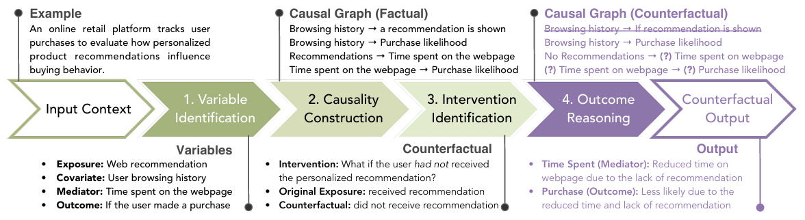
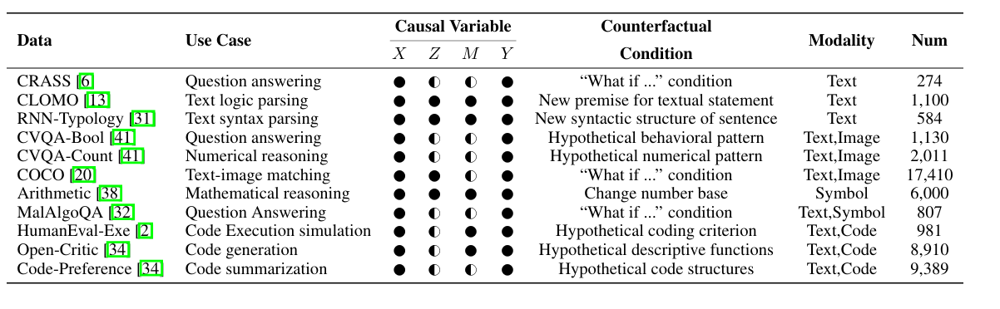
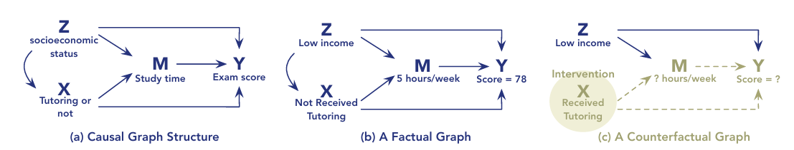

# On the Eligibility of LLMs for Counterfactual Reasoning: A Decompositional Study

<!--
## ⚠️ IMPORTANT
This repository is anonymous and is solely intended for review purposes.
--> 

## 💡 Introduction
This repository contains the code and resources for our research on **Counterfactual Reasoning** in Large Language Models (LLMs). We introduce a systematic framework that includes standardized processes for counterfactual generation, evaluation, and interpretation across multiple domains. More importantly, we outline a **Decompositional Strategy** that breaks down the analysis of counterfactual reasoning. This approach departs from prior work that focuses solely on counterfactual generation. Instead, we begin by examining the causal structure of factual conditions, which serves as the necessary foundation for valid counterfactual reasoning.

**Workflow and Illustrative Example for Decompositional Strategy**

## 📊 Datasets & Models
**Datasets (5 task categories)**:

- Question Answering: CRASS, CVQA-Bool, MalAlgoQA
- Text Parsing: CLOMO, RNN-Typology
- Reasoning: CVQA-count, Arithmetic
- Multimodal: COCO
- Code: HumanEval-Exe, Open-Critic, Code-Preference

**Models**:

- GPT-4o, Qwen2.5-VL, LLaMA-3.2-11B, Gemini-Pro, DeepSeek-VL

**Modalities**: 
- Text, Images, Math symbols, Code

**Summary of Counterfactual Benchmarks**

## 📝 Decomposing Counterfactual Reasoning
To adapt these datasets for counterfactual reasoning evaluation, we conduct a careful manual curation process to augment each instance with three additional aspects of information. Specifically, we begin by identifying and annotating the **causal variables** ($X$, $Z$, $M$, $Y$) from the original data, questions, or descriptions. Using these annotations, we construct a DAG to represent the underlying causal structure of each data instance.

**Causal Variables - 4 Roles**
- Exposure(or intervention, denoted $X$) refers to the action or condition imposed on a system;
- Outcome ($Y$) denotes the resulting response or effect influenced by the exposure;
- Covariates ($Z$) are pre-treatment variables that may influence both $X$ and $Y$;
- Mediator ($M$) lies on the causal pathway from $X$ to $Y$, representing intermediate mechanisms through which the exposure exerts its influence.
- 

**Illustrative Example**

**Example:** As exemplified in (b), a student with $z = LOW-INCOME$ socioeconomic status did not receive tutoring ($x = 0$), studied 5 hours per week (m = 5), and scored 78 on the exam ($y = 78$).  
**We now ask:** *What would the student’s score have been if they had received tutoring (x' = 1)?*  
**We compute:**  (i) Simulated study time:  m' = f_M(x' = 1, z = LOW-INCOME) = 9 and (ii) Counterfactual score: Y_{x'=1} = f_Y(x' = 1, m' = 9, z = LOW-INCOME) = 85.  
**We conclude:** *The tutoring would have increased the student’s score from 78 to 85 (c).*  

## 📜 License
Distributed under the MIT License 📄. See [`LICENSE`](LICENSE) for more information.
